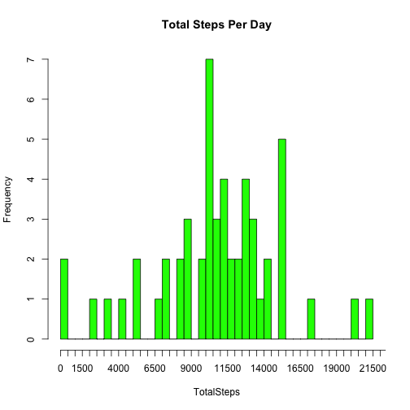
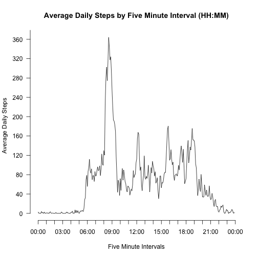
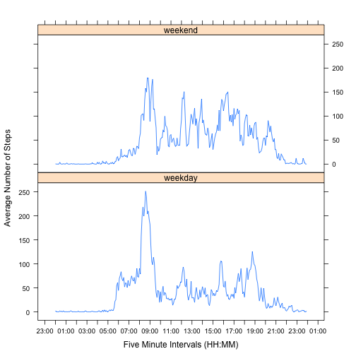

##Introduction

This document contains the results required for Assignment #1 of the Johns Hopkins University Reproducible Research Course on Coursera.org.  The premise of the assignment as provided by the instructors is as follows:

"It is now possible to collect a large amount of data about personal movement using activity monitoring devices such as a Fitbit, Nike Fuelband, or Jawbone Up. These type of devices are part of the “quantified self” movement – a group of enthusiasts who take measurements about themselves regularly to improve their health, to find patterns in their behavior, or because they are tech geeks. But these data remain under-utilized both because the raw data are hard to obtain and there is a lack of statistical methods and software for processing and interpreting the data.

This assignment makes use of data from a personal activity monitoring device. This device collects data at 5 minute intervals through out the day. The data consists of two months of data from an anonymous individual collected during the months of October and November, 2012 and include the number of steps taken in 5 minute intervals each day."

The data provided for the assignment contains 17,568 observations, is stored in a comma-separated-value (CSV) file, and has the following format:

    * steps: Number of steps taking in a 5-minute interval (missing values are coded as NA)
    * date: The date on which the measurement was taken in YYYY-MM-DD format
    * interval: Identifier for the 5-minute interval in which measurement was taken
<br>
   
##Assignment Results

<br>

####The first step was to read the file into a data frame in memory.


```r
activity <- read.csv("~/Desktop/Coursera/Reproducible Research/activity.csv")
```

<br>

#### Next a summary of the data was produced in order to gain an initial understanding of the data including the whether there any missing data elements.  


```r
summary(activity)
```

```
##      steps                date          interval     
##  Min.   :  0.00   2012-10-01:  288   Min.   :   0.0  
##  1st Qu.:  0.00   2012-10-02:  288   1st Qu.: 588.8  
##  Median :  0.00   2012-10-03:  288   Median :1177.5  
##  Mean   : 37.38   2012-10-04:  288   Mean   :1177.5  
##  3rd Qu.: 12.00   2012-10-05:  288   3rd Qu.:1766.2  
##  Max.   :806.00   2012-10-06:  288   Max.   :2355.0  
##  NA's   :2304     (Other)   :15840
```

<br>

#### A histogram was produced to show a frequency distribution of the Total steps per day.
     (Note: The data was summarized by day using the tapply function)

```r
TotalSteps<-tapply(activity[,1], activity[,2], sum)
hist(TotalSteps, breaks = 50, col="green", axes=F,main="Total Steps Per Day")
axis(1, at=seq(from=0, to=25000, by=500))
axis(2)
```



<br>

#### Next the mean and median number of steps taken each day were calculated.
     (Note: NA values were eliminated before performing the calculations)


```r
x<-as.numeric(TotalSteps)
good<-!is.na(x)
goodmean<-mean(x[good])
goodmedian<-median(x[good])
```

The mean and median number of steps taken each day were found to be 10766.19 and 10765, respectively.

<br>

#### A time series plot of the average number of steps taken was then produced.


```r
# The tapply function was used to summarize the steps by five minutes interval then the calculate the average daily steps per interval

allgood <-!is.na(activity[,1])
a<-activity[allgood,]
intervalSteps<-tapply(a[,1], a[,3], sum)
AvgSteps<- intervalSteps/30

# Convert interval numbers to time (HHMM) format

interval<-unique(activity[,3])
intervalHHMM<-strptime(sprintf("%04d", interval), format="%H%M")

# Plot average daily steps by five minute intervals

par(las=1)
plot(intervalHHMM,AvgSteps, type="l", main="Average Daily Steps by Five Minute Interval (HH:MM)",
        axes=F,xlab="Five Minute Intervals",ylab="Average Daily Steps")
axis.POSIXct(1,at=seq.POSIXt(as.POSIXlt(format(Sys.Date(), "%Y-%m-%d")), as.POSIXlt(format(Sys.Date()+1, "%Y-%m-%d")), by="hour"))
axis(2, at=seq(from=0, to=2000, by=40)) 
```



<br>

#### The 5-minute interval that, on average, contains the maximum number of steps was determined.

The 5-minute interval containing the maximum number of steps is the interval beginning at 08:35.

<br>

#### The total number of rows in the dataset with missing values was determined and those missing values were filled with an average value.

The summary run at the beginning of this exercise showed that the only variable in the dataset with missing values was the steps variable.  That summary showed that 2304 steps values were missing.

The following program code counts the number of NAs in the steps variable and replaces them with the average number of steps for that interval.


```r
# Set counters

actRows<-nrow(activity)
rowNum<-1
na1<-0

# Copy activity data to new data frame

newActivity<-activity

# Check for NAs and replace them with 

while(rowNum<actRows+1) {
     isna<-FALSE
     isna<-is.na(activity[rowNum,1])
     if (isna==TRUE) {
         na1<-na1+1
         newActivity[rowNum,1]<-round(AvgSteps[[as.character(activity[[rowNum, 3]])]])
     }

     rowNum<-rowNum+1
 }
```
The number of rows found to have missing values was 2304.

<br>

#### A histogram was produced to show a frequency distribution of the Total steps per day when missing values had been assigned estimated values.


```r
# Use the tapply function to summarize the data by day

TotalStepsNoNa<-tapply(newActivity[,1], newActivity[,2], sum)

# Plot the total number of steps per day 

hist(TotalStepsNoNa, breaks = 50, col="blue", axes=F,main="Total Steps Per Day (No NAs)", xlab="Total Steps")
axis(1, at=seq(from=0, to=25000, by=500))
axis(2)
```


<br>

#### The mean and median number of steps taken each day were calculated with NAs eliminated.

The mean and median number of steps taken each day, when missing values had been assigned estimated values, were found to be 11848.26 and 11458, respectively.

When missing values were filled with estimated values the mean value increased from 10766.19 to 11848.26 and the median value increased from 10765 to 11458.

<br>

#### Differences in activity patterns between weekdays and weekends were plotted.


```r
# Add a factor variable containing the day of the week and then convert the levels to indicate whether the record was for a weekday or weekend.

wkdays<-data.frame(weekdays(as.Date(newActivity[,2])))
colnames(wkdays)<-c("weekend")
newActivity2<-cbind(newActivity, wkdays)
levels(newActivity2[,4])<-c("weekday", "weekday", "weekend", "weekend", "weekday", "weekday", "weekday")

# Split the data into weekend data and weekday data

splNewAct2<-split(newActivity2,newActivity2[4])
splwkday<-splNewAct2[[1]]
splwkend<-splNewAct2[[2]]

# Use the tapply function to calculate the the mean values for weekday and weekend data

splwkdaymean<-tapply(splwkday[,1], splwkday[,3], mean)
splwkendmean<-tapply(splwkend[,1], splwkend[,3], mean)

# Convert interval values to time format HHMM

intervalHHMM<-strptime(sprintf("%04d", interval), format="%H%M") 

# create a data frame that contains the mean values, interval values, and weekday factor

wkday<-"weekday"
length(wkday)<-288
wkday[1:288]<-"weekday"
wkdaydata<-cbind.data.frame(splwkdaymean, intervalHHMM, wkday)
colnames(wkdaydata)<-c("Steps", "intervalHHMM","wkdayfac")

# create a data frame that contains the mean values, interval values, and weekend factor

wkend<-"weekend"
length(wkend)<-288
wkend[1:288]<-"weekend"
wkenddata<-cbind.data.frame(splwkendmean, intervalHHMM, wkend)
colnames(wkenddata)<-c("Steps", "intervalHHMM","wkdayfac")

# Combine data into one data frame

alldata<-rbind(wkdaydata, wkenddata)

# Plot the weekday and weekend data in a panel plot

library(lattice)

xyplot(Steps~intervalHHMM | wkdayfac, data=alldata, type="l", 
       layout=(c(1, 2)), xlab="Five Minute Intervals (HH:MM)", 
       ylab="Average Number of Steps", 
       scales=list(x=list(tick.number=24,format="%H:%M")))
```


